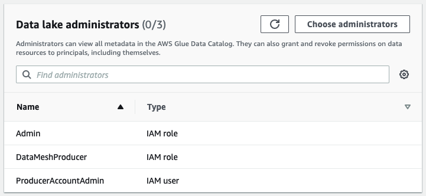

# Tests for Data Mesh Utils

In this directory you will find various tests that show the functionality of the Data Mesh Utility, including:

* `data_mesh_account_tests.py`: Tests which set up the central Data Mesh Account
* `producer_account_tests.py`: Tests for the Producer side of data production creation and subscription access
* `consumer_account_tests.py`: Tests for a Consumer to request access to a product and import subscription objects
* `integration.py`: Full integration test showing configuration of the central mesh account, creation of a data product, request of access, and granting access for a consumer.

## Getting Started

Each test requires the configuration of a `CredentialsFile` environment variable, which is a JSON document on your 
filesystem that provides access to the Accounts to be used across the Test Suite. The structure of this file is shown 
below (you must remove comments), or you can start with [`sample_test_creds.json`](sample_test_creds.json).

```json
{
  "AWS_REGION": "us-east-1",
  # must be LF data lake admin in the mesh account
  "Mesh": {
    "AccountId": "",
    "AccessKeyId": "",
    "SecretAccessKey": ""
  },
  "Producer": {
    "AccountId": "",
    "AccessKeyId": "",
    "SecretAccessKey": ""
  },
  # must be LF data lake admin in a producer account
  "ProducerAdmin":{
    "AccountId": "",
    "AccessKeyId": "",
    "SecretAccessKey": ""
  },
  "Consumer": {
    "AccountId": "",
    "AccessKeyId": "",
    "SecretAccessKey": ""
  },
  # must be LF data lake admin in a consumer account
  "ConsumerAdmin": {
    "AccountId": "",
    "AccessKeyId": "",
    "SecretAccessKey": ""
  }
}
```

This file allows for the configuration of multiple accounts, for the Data Mesh, and then a "normal" user and Administration
user for both the producer and consumer. Please note that the keys of this document are reserved and cannot be changed or extended
(`Mesh`, `Producer`, `ProducerAdmin`, `Consumer`, and `ConsumerAdmin` are all reserved words).

In general, you should start by configuring administrative users `Mesh`, `ProducerAdmin`, and `ConsumerAdmin` administrators. You can then
setup the core Data Mesh functionality, and then add `Producer` and `Consumer` entries from the respective accounts after
enabling Access Keys for the created `DataMeshProducer` and `DataMeshConsumer` sample users.

Please note that `Mesh`, `ProducerAdmin`, and `ConsumerAdmin` must all be assigned Data Lake Admin permissions in Lake Formation. This permissions
Grant falls out of the scope of this utility as it requires root or Data Lake Admin to assign. You can assign these permissions using the
AWS Console in the Account you wish to configure.

In the AWS Console, choose the Lake Formation service, and then in the left-hand Nav choose Permissions/Administrative Roles & Tasks. Add the User or Role
configured above as data lake administrator:

